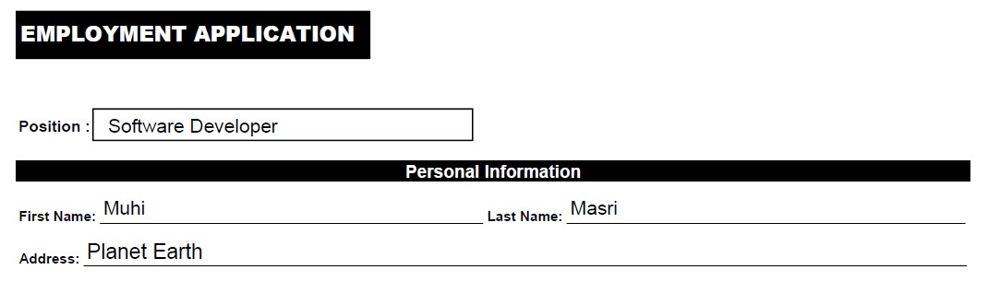

# AWS Textract App
Convert an image to an HTML form using Amazon Textract and NodeJS.

# Usage:
Clone repository, npm install and use image below for testing. You also need to create your own .env file with the required AWS configuratioins.

